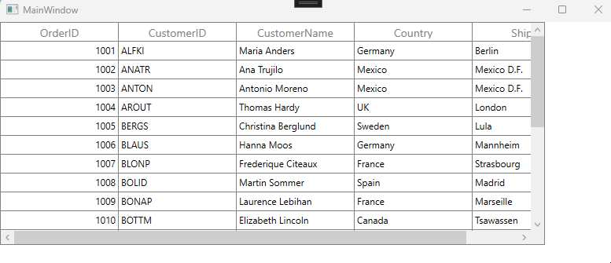

# How to scroll vertically by less than a full row in a WPF DataGrid?


In [WPF DataGrid](https://www.syncfusion.com/wpf-controls/datagrid) (SfDataGrid), vertical scrolling by default advances one full row at a time. This behavior can be customized to scroll by specific units by adjusting the vertical offset within the `ScrollChanged` event.

 ```csharp
sfDataGrid.Loaded += OnLoaded;

private void OnLoaded(object sender, RoutedEventArgs e)
{
    this.sfDataGrid.GetVisualContainer().ScrollOwner.ScrollChanged += OnScrollChanged;          
}

private void OnScrollChanged(object sender, ScrollChangedEventArgs e)
{
    if (e.VerticalChange == 24)
     {
        if (e.VerticalChange > 0)
         {                    
             // Here customize based on your scenario
             double newOffset = e.VerticalOffset - 12;            
             this.sfDataGrid.GetVisualContainer().SetVerticalOffset(newOffset);
         }
     }
     if (e.VerticalChange == -24)
      {
         if (e.VerticalChange < 0)
          {
              // Here customize based on your scenario
              double newOffset = e.VerticalOffset + 12;              
            this.sfDataGrid.GetVisualContainer().SetVerticalOffset(newOffset);
           }
      }
  } 
 ```


